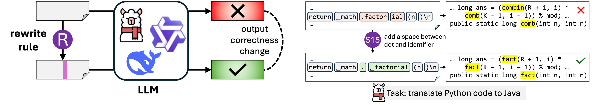
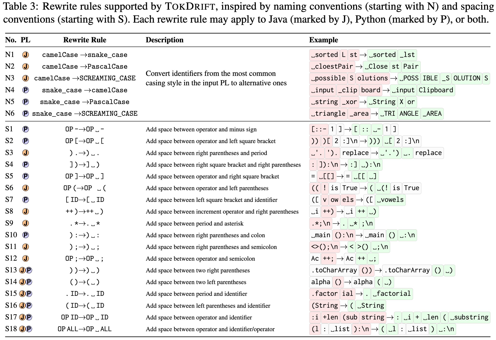
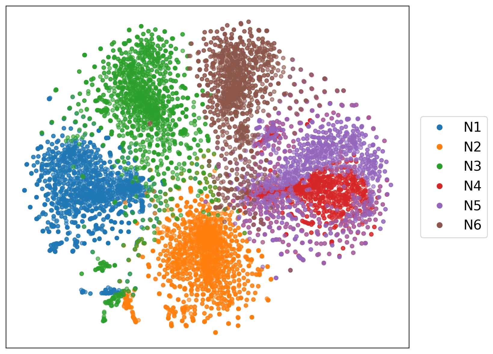
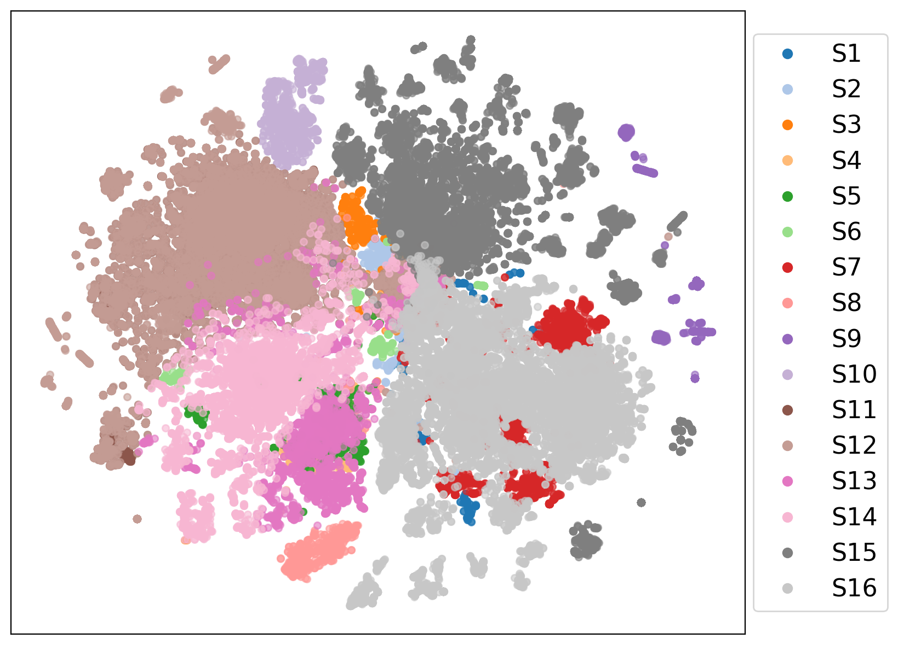
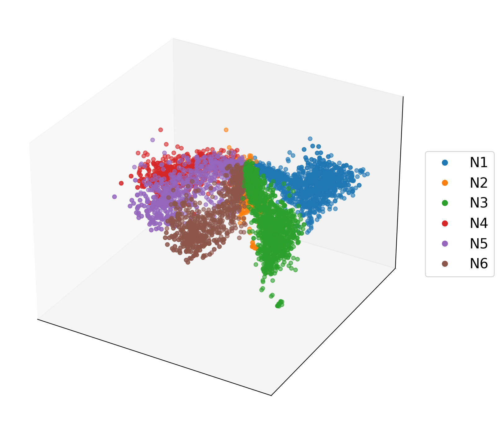
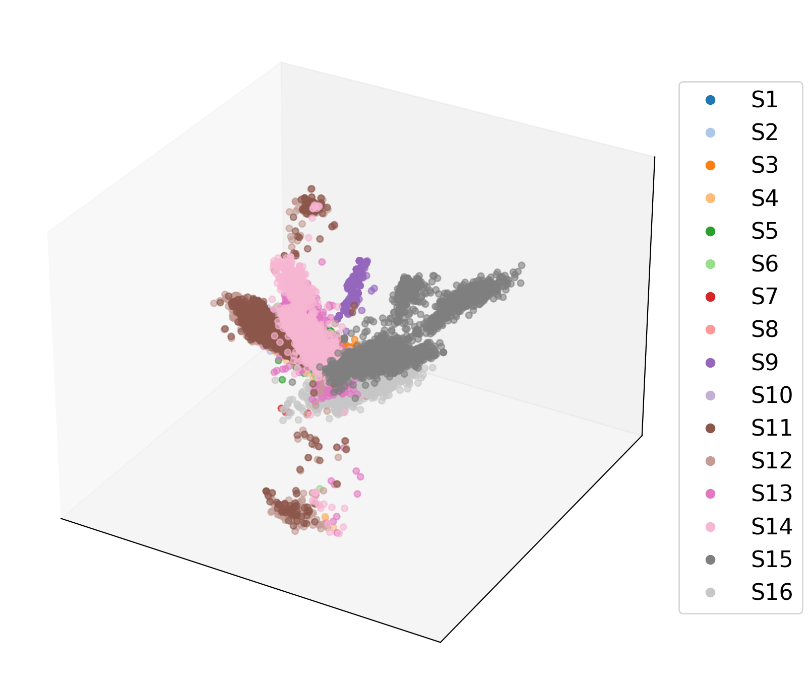

<h1 align="center"> TokDrift: When Code Tokens Meet NL Tokenizers </h1>

<p align="center">
  
</p>

This is the repository for the paper [TokDrift: When LLM Speaks in Subwords but Code Speaks in Grammar](https://github.com/uw-swag/tokdrift). TokDrift is a framework designed to apply semantic-preserving rewrite rules and measure their influence on various code-related tasks.

## ⚙️ Environment Setup

Run the provided setup script to create a [conda environment](https://www.anaconda.com/docs/getting-started/miniconda/main) with the dependencies:

```bash
bash prepare-env.sh
```

Activate the environment for running the experiments:

```bash
conda activate tokdrift
```

For testing generated code, set up a virtual environment with required dependencies:

```bash
mkdir venv && cd venv
uv venv ./python3_8 --python 3.8
uv pip install --python ./python3_8/bin/python numpy scipy networkx
cd ..
```

This environment is used to execute and validate generated code during experiments.

## ✏️ Dataset Preparation

Download the Avatar dataset from Hugging Face:

```bash
cd datasets
# requires Git LFS installed
GIT_LFS_SKIP_SMUDGE=0 git clone https://huggingface.co/datasets/iidai/avatar
# Normalize the dataset
python scripts/split_avatar.py
mv ./data/input/avatar/base.py ./datasets/avatar/base/base.py
cd ..
```

Generate rewrite dataset for Avatar tasks only:

```bash
python -m src.tokdrift.data_generator --process_avatar
# Move the dataset config file to the datasets folder
mv ./data/input/avatar/var.py ./datasets/avatar/var/var.py
```

(Optional) Generate rewrite dataset for all tasks (already prepared for humaneval and codenet tasks):

```bash
python -m src.tokdrift.data_generator --all
```

## 💡 Example Scripts

Two example scripts for running baseline and variant experiments are provided in the [`scripts`](scripts) directory:

- [`baseline_example.sh`](scripts/baseline_example.sh) - Example for running baseline experiments
- [`variant_example.sh`](scripts/variant_example.sh) - Example for running variant experiments

<b><ins>Please refer to the following sections (click to expand) for detailed usage instructions.</ins></b>

<details close>
<summary><b><font size="5">📌 Running Experiments</font></b></summary>

#### Environment Variables

Set these variables before running experiments:

```bash
MODEL="your-model-name"
MAX_LENGTH_GENERATION=1024
PROMPT="prompt-type"
LANGUAGE="python"
PRECISION="bf16"
DO_SAMPLE=False
N_SAMPLES=1
BATCH_SIZE=1
SAVE_GENERATIONS_PATH="path/to/save/generations"
METRIC_OUTPUT_PATH="path/to/save/metrics"
HIDDEN_STATES_SAVE_PATH="path/to/save/hidden_states"
```

*Note that tokenizer's behavior varies across different model series. Special tokenizers may raise errors when analyzing the results (fragment analysis).*

#### HumanEval Explain Tasks (Two-Stage)

Following the setup in [bigcode-evaluation-harness](https://github.com/bigcode-project/bigcode-evaluation-harness), this task requires two stages: describe then synthesize.

**Stage 1: Describe**

```bash
TASK_1_NAME="humanevalexplaindescribe"

accelerate launch --num_processes 1 -m src.tokdrift.run_experiments \
  --model $MODEL \
  --max_length_generation $MAX_LENGTH_GENERATION \
  --prompt $PROMPT \
  --tasks $TASK_1_NAME-$LANGUAGE \
  --precision $PRECISION \
  --do_sample $DO_SAMPLE \
  --n_samples $N_SAMPLES \
  --batch_size $BATCH_SIZE \
  --allow_code_execution \
  --trust_remote_code \
  --save_generations \
  --save_generations_path $SAVE_GENERATIONS_PATH \
  --generation_only \
  --hidden_states_save_path $HIDDEN_STATES_SAVE_PATH \
  --max_memory_per_gpu "auto"
```

**Stage 2: Synthesize**

```bash
TASK_2_NAME="humanevalexplainsynthesize"
LOAD_GENERATIONS_PATH="path/from/stage1"

accelerate launch --num_processes 1 -m src.tokdrift.run_experiments \
  --model $MODEL \
  --max_length_generation $MAX_LENGTH_GENERATION \
  --prompt $PROMPT \
  --load_data_path $LOAD_GENERATIONS_PATH \
  --tasks $TASK_2_NAME-$LANGUAGE \
  --precision $PRECISION \
  --do_sample $DO_SAMPLE \
  --n_samples $N_SAMPLES \
  --batch_size $BATCH_SIZE \
  --allow_code_execution \
  --trust_remote_code \
  --save_generations \
  --save_generations_path $SAVE_GENERATIONS_PATH \
  --metric_output_path $METRIC_OUTPUT_PATH \
  --max_memory_per_gpu "auto"
```

#### Other Tasks (Single-Stage)

For tasks like CodeNet Translate, Avatar Translate, and HumanEval Fix Tests:

```bash
# Choose one:
TASK_1_NAME="codenettranslate"
# TASK_1_NAME="avatartranslate"
# TASK_NAME="humanevalfixtests"

accelerate launch --num_processes 1 -m src.tokdrift.run_experiments \
  --model $MODEL \
  --max_length_generation $MAX_LENGTH_GENERATION \
  --prompt $PROMPT \
  --tasks $TASK_1_NAME-$LANGUAGE \
  --precision $PRECISION \
  --do_sample $DO_SAMPLE \
  --n_samples $N_SAMPLES \
  --batch_size $BATCH_SIZE \
  --allow_code_execution \
  --trust_remote_code \
  --save_generations \
  --save_generations_path $SAVE_GENERATIONS_PATH \
  --metric_output_path $METRIC_OUTPUT_PATH \
  --hidden_states_save_path $HIDDEN_STATES_SAVE_PATH \
  --max_memory_per_gpu "auto"
```

*Storing hidden states is currently not supported when using data parallelism.*

</details>

<details close>
<summary><b><font size="5">📍 Task Variants</font></b></summary>

#### HumanEval Fix Task

For HumanEval Fix tasks with variants:

```bash
TASK_NAME="humanevalfixtests"
COMBINED_TOKEN_VARIANT="snake_case"  # or any variant from list below

accelerate launch --num_processes 1 -m src.tokdrift.run_experiments \
  --model $MODEL \
  --tasks $TASK_NAME-$LANGUAGE-$COMBINED_TOKEN_VARIANT-fix \
  [other parameters...]
```

#### Other Tasks with Variants

For CodeNet Translate, Avatar Translate, and other tasks:

```bash
TASK_1_NAME="codenettranslate"  # or avatartranslate
SPECIFIC_CASE="snake_case"  # or any variant from list below

accelerate launch --num_processes 1 -m src.tokdrift.run_experiments \
  --model $MODEL \
  --tasks $TASK_1_NAME-$LANGUAGE-$SPECIFIC_CASE \
  [other parameters...]
```

#### Available Variants

- `snake_case`
- `pascal_case`
- `screaming_snake_case`
- `camel_case`
- `op_dash`
- `op_lsquarebracket`
- `rparentheses_period`
- `rsquarebracket_rparentheses`
- `op_rsquarebracket`
- `op_lparentheses`
- `lsquarebracket_name`
- `double_plus_rparentheses`
- `period_asterisk`
- `rparentheses_colon`
- `rparentheses_semicolon`
- `op_semicolon`
- `rparentheses_rparentheses`
- `lparentheses_rparentheses`
- `period_name`
- `lparentheses_name`
- `op_name`
- `op_all`

<p align="center">
  
</p>

</details>

## 📝 Result Analysis
After running experiments, analyze the results using the following commands:

### Extract All Result Datapoints

First, extract all result datapoints from the log files in the output directory:

```bash
python -m src.tokdrift.result_extractor --all
```

This processes all tasks, models, naming variants, and spacing variants to generate evaluation JSON files with detailed result datapoints.

### Summarize Results to CSV

Generate CSV summary files for all results:

```bash
python -m src.tokdrift.result_extractor --sum_to_csv
```

This creates comprehensive CSV files in `./data/output/` containing:
- Accuracy results
- Accuracy deltas comparing baseline vs variant
- Sensitivity analysis across all variants
- Per-task and per-model breakdowns

### Additional Analysis Options

Utilize [`result_evaluator.py`](src/tokdrift/result_evaluator.py) to gather all result datapoints for sensitivity analysis. 

<b><ins>Get Summary and Sensitivity Results</ins></b>:

```bash
python -m src.tokdrift.result_evaluator --diff
```

This outputs:
- Total number of processed tasks across all experiments
- Sensitivity results showing how naming and spacing variants affect task results
- Including breakdown by fragment change types (merged, split, mixed, unchanged)

Output files are saved to:
- `./data/output/sensitivity/` - Sensitivity percentages
- `./data/output/sample_info/` - Sample counts and statistics

<b><ins>Wilcoxon Signed-Rank Test</ins></b>:

Test the statistical significance of performance differences between various model sizes within one model series:

```bash
python -m src.tokdrift.result_evaluator --wilcoxon_test
```

This compares small, medium, and large model variants (e.g., Llama-3 3B vs 8B vs 70B) to determine if larger models show significantly different sensitivity.

<b><ins>Vector Visualization</ins></b>:

Visualize hidden state representations difference, please check the [`vector_visualizer.py`](src/tokdrift/vector_visualizer.py) for more details:

```bash
# Generate 2D t-SNE visualizations
python -m src.tokdrift.vector_visualizer --vector --model "Qwen2.5-Coder-32B-Instruct"

# Generate 3D PCA visualizations
python -m src.tokdrift.vector_visualizer --vector_3d --model "Llama-3.3-70B-Instruct"

# Generate similarity plots
python -m src.tokdrift.vector_visualizer --similarity --model "deepseek-coder-33b-instruct"
```

<details close>
<summary><b><font size="5">🎇 Example: 2D Visualizations (t-SNE)</font></b></summary>

<table>
  <tr>
    <td width="50%">
      <p align="center">
        
      </p>
      <p align="center"><i>Naming variants visualization from Qwen2.5-Coder-32B-Instruct (middle layer)</i></p>
    </td>
    <td width="50%">
      <p align="center">
        
      </p>
      <p align="center"><i>Spacing variants visualization from Qwen2.5-Coder-32B-Instruct (middle layer)</i></p>
    </td>
  </tr>
</table>

</details>

<details close>
<summary><b><font size="5">🎆 Example: 3D Visualizations (PCA)</font></b></summary>

<table>
  <tr>
    <td width="50%">
      <p align="center">
        
      </p>
      <p align="center"><i>Naming variants visualization from Llama-3.1-8B-Instruct (last layer)</i></p>
    </td>
    <td width="50%">
      <p align="center">
        
      </p>
      <p align="center"><i>Spacing variants visualization from deepseek-coder-33b-instruct (last layer)</i></p>
    </td>
  </tr>
</table>

</details>

## 🍻 Acknowledgements

This project builds upon and is inspired by several excellent codebases:

- [bigcode-evaluation-harness](https://github.com/bigcode-project/bigcode-evaluation-harness) - Evaluation framework for code generation models
- [antlr4](https://github.com/antlr/antlr4) - Programming language parser
- [grammars-v4](https://github.com/antlr/grammars-v4) - Grammars written for ANTLR v4

Please open an issue if you run into any problems or have any suggestions. 

